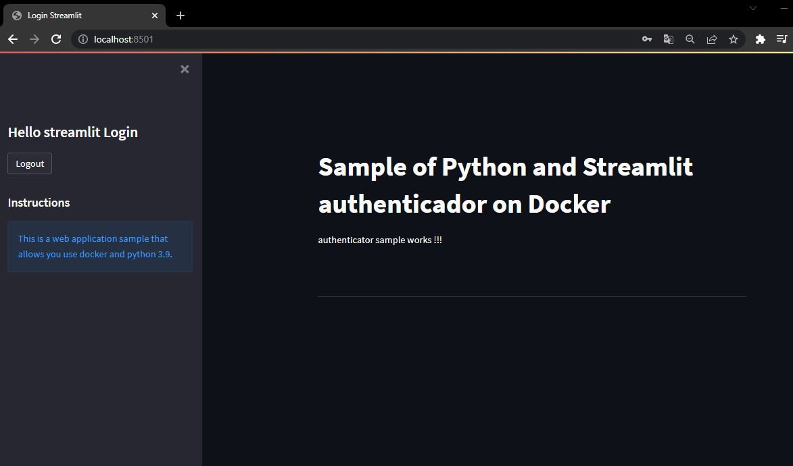

# Streamlit_authenticador_docker
This repository is to share a simple Streamlit authenticador app on docker ubuntu 20.04  

# Instructions:  
this app run well on python 3.9 or later. 
you need a docker later version installed. 

# On DockerFile:  
You have the steps to install dependencies and features to ubuntu. 
to run you can open a Terminal CMD and run the following commands: 

# Commands:
docker build -f Dockerfile -t appteste:latest . 
docker run -it -p 8501:8501 appteste

# Applications Screens: 

Screem 1: Login Page  
 

Screem 2: Main Page sample  

  
 
 ### For more Content about Streamlit please contact me or see my channel:
- Youtube Channel: devwithdigas  
- Site: www.devwithdigas.com.br  

 
